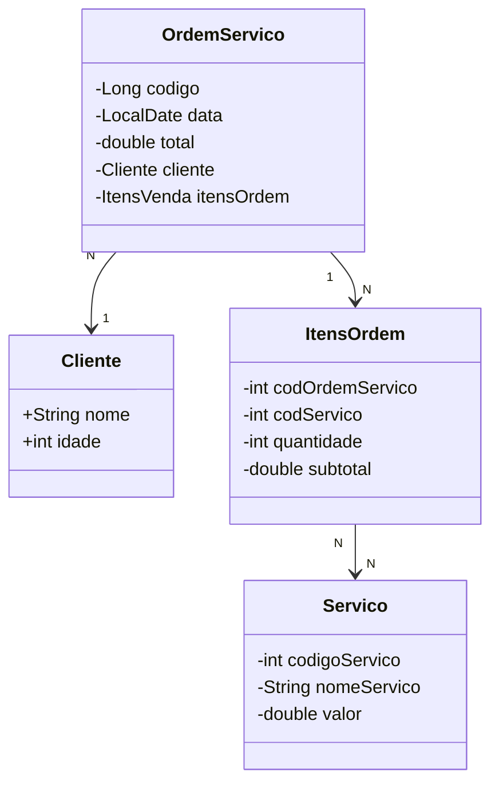

**Diagrama de Classes

```mermaid
classDiagram
        OrdemServico "N" --> "1" Cliente
        OrdemServico "1"--> "N" ItensOrdem
        ItensOrdem "N" --> "N" Servico
        OrdemServico : -Long codigo
        OrdemServico : -LocalDate data
        OrdemServico : -double total
        OrdemServico : -Cliente cliente   
        OrdemServico : -ItensVenda itensOrdem      
        class Cliente {
          +String nome
          +int idade
        }
        class ItensOrdem{
          -int codOrdemServico
          -int codServico
          -int quantidade
          -double subtotal
        }
        class Servico {
          -int codigoServico
          -String nomeServico
          -double valor
        }

```
